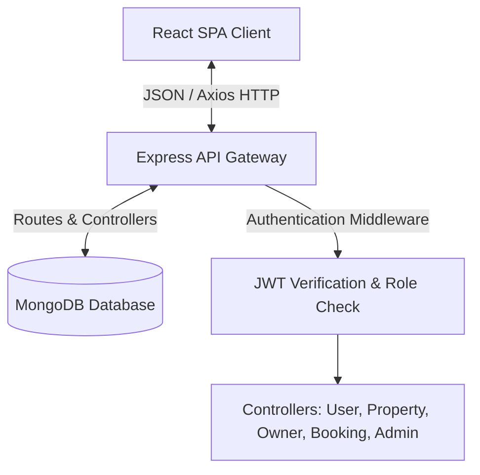
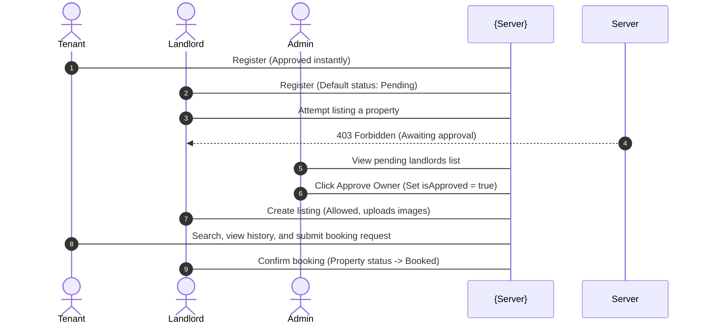

# HouseHunt - MERN House Rental Platform

HouseHunt is a modern, high-performance, and feature-rich MERN-stack rental platform that simplifies house hunting by directly connecting **Tenants/Renters**, **Property Owners/Landlords**, and a governing **Admin**. 

The platform features role-based access control, advanced property search filters, user-activity history logging, landlord profile verification flows, and inquiry management dashboards.

---

## 1. System Architecture

HouseHunt is designed using the **Model-View-Controller (MVC)** architectural pattern. 

### Data Flow Diagram


### User Onboarding & Approval Flow


---

## 2. Technology Stack

* **Frontend**:
  * **React (Vite)**: Clean Single Page Application (SPA).
  * **Styling**: Bootstrap 5 + Vanilla CSS (Custom dark glassmorphic styling).
  * **Components & Icons**: Material UI (MUI) icons & controls.
  * **Animations**: Framer Motion page transitions and scroll indicators.
  * **HTTP Client**: Axios (configured with automated JWT interceptors).
* **Backend**:
  * **Node.js & Express**: High-performance RESTful API gateway.
  * **Mongoose & MongoDB**: Dynamic schema definition and document querying.
  * **Authentication**: JWT (JSON Web Tokens) + Bcryptjs password hashing.
  * **File Uploads**: Multer middleware storing images locally (`uploads/`).

---

## 3. Database Schemas

### User Schema (`models/UserSchema.js`)
Stores authentication credentials, personal attributes, role types, and a history of saved filters:
* `Name` (String, required)
* `Email` (String, required, unique)
* `Phone` (String, required)
* `Password` (String, required, bcrypt hashed)
* `UserType` (String: `'Tenant' | 'Owner' | 'Admin'`)
* `ProfileImage` (String, optional path)
* `isApproved` (Boolean, defaults to `true` for Tenants/Admins, `false` for Owners)
* `CurrentLocation` (String)
* `SavedSearches`: Array of `{ name: String, query: Object, createdAt: Date }`

### Property Schema (`models/PropertySchema.js`)
Represents rental units listed on the system:
* `OwnerID` (ObjectId, ref: `'User'`)
* `Title` (String, required)
* `Description` (String, required)
* `Location` (String, required)
* `RentAmount` (Number, required)
* `PropertyType` (String: `'Apartment' | 'House' | 'Studio'`)
* `FurnishingStatus` (String: `'Furnished' | 'Semi-Furnished' | 'Unfurnished'`)
* `Amenities` (Array of Strings)
* `Images` (Array of Strings)
* `Status` (String: `'Available' | 'Booked'`, defaults to `'Available'`)

### Booking Schema (`models/BookingSchema.js`)
Logs rental inquiries sent by Tenants to Owners:
* `TenantID` (ObjectId, ref: `'User'`)
* `PropertyID` (ObjectId, ref: `'Property'`)
* `StartDate` (Date, required)
* `EndDate` (Date, required)
* `Status` (String: `'Pending' | 'Confirmed' | 'Cancelled'`, defaults to `'Pending'`)
* `Message` (String)

---

## 4. API Documentation

### 4.1 Authentication & Profile Endpoints

#### Register User
* **Method**: `POST`
* **Route**: `/api/users/register`
* **Headers**: `Content-Type: multipart/form-data`
* **Body Form Parameters**:
  * `Name`: `John Doe`
  * `Email`: `john@example.com`
  * `Phone`: `+1234567890`
  * `Password`: `password123`
  * `UserType`: `Tenant` (or `Owner` or `Admin`)
  * `CurrentLocation`: `Hyderabad`
  * `ProfileImage`: `[File upload]` (optional)
* **Response (201 Created)**:
  ```json
  {
    "message": "User registered successfully",
    "token": "eyJhbGciOiJIUzI1NiIsIn...",
    "user": {
      "id": "6a4cabe84ad6de21d96776ad",
      "Name": "John Doe",
      "Email": "john@example.com",
      "UserType": "Tenant"
    }
  }
  ```
* **cURL Command**:
  ```bash
  curl -X POST http://localhost:5000/api/users/register \
    -F "Name=John Doe" \
    -F "Email=john@example.com" \
    -F "Phone=+1234567890" \
    -F "Password=password123" \
    -F "UserType=Tenant" \
    -F "CurrentLocation=Hyderabad"
  ```

#### Login User
* **Method**: `POST`
* **Route**: `/api/users/login`
* **Headers**: `Content-Type: application/json`
* **Body (JSON)**:
  ```json
  {
    "Email": "john@example.com",
    "Password": "password123"
  }
  ```
* **Response (200 OK)**:
  ```json
  {
    "token": "eyJhbGciOiJIUzI1NiIsIn...",
    "user": {
      "id": "6a4cabe84ad6de21d96776ad",
      "Name": "John Doe",
      "Email": "john@example.com",
      "UserType": "Tenant",
      "isApproved": true
    }
  }
  ```
* **cURL Command**:
  ```bash
  curl -X POST http://localhost:5000/api/users/login \
    -H "Content-Type: application/json" \
    -d '{"Email":"john@example.com", "Password":"password123"}'
  ```

---

### 4.2 Saved Searches (Tenant Only)

#### Save Search Query
* **Method**: `POST`
* **Route**: `/api/users/saved-searches`
* **Headers**: `Authorization: Bearer <token>`
* **Body (JSON)**:
  ```json
  {
    "name": "Hyderabadi Apartments Under 1000",
    "query": {
      "location": "Hyderabad",
      "maxRent": "1000",
      "propertyType": "Apartment"
    }
  }
  ```
* **Response (200 OK)**:
  ```json
  {
    "message": "Search saved successfully",
    "savedSearches": [
      {
        "_id": "6a4cb02f4ad6de21d9677712",
        "name": "Hyderabadi Apartments Under 1000",
        "query": {
          "location": "Hyderabad",
          "maxRent": "1000",
          "propertyType": "Apartment"
        }
      }
    ]
  }
  ```
* **cURL Command**:
  ```bash
  curl -X POST http://localhost:5000/api/users/saved-searches \
    -H "Authorization: Bearer <YOUR_TOKEN>" \
    -H "Content-Type: application/json" \
    -d '{"name": "Hyderabadi Apartments Under 1000", "query": {"location": "Hyderabad", "maxRent": "1000", "propertyType": "Apartment"}}'
  ```

---

### 4.3 Public & Tenant Properties Endpoints

#### Get Properties (with Filters)
* **Method**: `GET`
* **Route**: `/api/properties`
* **Query Parameters (All Optional)**:
  * `location`: Case-insensitive regex match (e.g. `Hyderabad`)
  * `minRent`: Minimum price threshold (e.g. `500`)
  * `maxRent`: Maximum price threshold (e.g. `1200`)
  * `propertyType`: `'Apartment' | 'House' | 'Studio'`
  * `furnishingStatus`: `'Furnished' | 'Semi-Furnished' | 'Unfurnished'`
  * `amenities`: Comma-separated list (e.g. `pool,garage`)
* **Response (200 OK)**:
  ```json
  [
    {
      "_id": "6a4cae8c4ad6de21d96776f1",
      "Title": "Cozy 1 BHK",
      "RentAmount": 600,
      "Location": "Hyderabad",
      "PropertyType": "Apartment",
      "FurnishingStatus": "Furnished",
      "Amenities": ["pool"],
      "Images": ["/uploads/property-1720235311894.jpg"],
      "Status": "Available"
    }
  ]
  ```
* **cURL Command**:
  ```bash
  curl -X GET "http://localhost:5000/api/properties?location=Hyderabad&maxRent=1000"
  ```

---

### 4.4 Booking & Inquiry Endpoints (Tenant Only)

#### Create Booking Inquiry
* **Method**: `POST`
* **Route**: `/api/bookings`
* **Headers**: `Authorization: Bearer <token>`
* **Body (JSON)**:
  ```json
  {
    "PropertyID": "6a4cae8c4ad6de21d96776f1",
    "StartDate": "2026-08-01",
    "EndDate": "2026-08-15",
    "Message": "I want to inspect this flat this weekend."
  }
  ```
* **Response (201 Created)**:
  ```json
  {
    "message": "Booking request submitted successfully",
    "booking": {
      "_id": "6a4cb1a54ad6de21d9677735",
      "TenantID": "6a4cabe84ad6de21d96776ad",
      "PropertyID": "6a4cae8c4ad6de21d96776f1",
      "StartDate": "2026-08-01T00:00:00.000Z",
      "EndDate": "2026-08-15T00:00:00.000Z",
      "Status": "Pending"
    }
  }
  ```
* **cURL Command**:
  ```bash
  curl -X POST http://localhost:5000/api/bookings \
    -H "Authorization: Bearer <YOUR_TOKEN>" \
    -H "Content-Type: application/json" \
    -d '{"PropertyID":"6a4cae8c4ad6de21d96776f1", "StartDate":"2026-08-01", "EndDate":"2026-08-15", "Message":"Inquiry info"}'
  ```

---

### 4.5 Owner Endpoints (Landlord Only)

#### Create Property Listing
* **Method**: `POST`
* **Route**: `/api/owner/properties`
* **Headers**: `Authorization: Bearer <token>`, `Content-Type: multipart/form-data`
* **Body Form Parameters**:
  * `Title`: `Cozy Studio near Central Park`
  * `Description`: `Beautiful fully furnished apartment.`
  * `Location`: `New York`
  * `RentAmount`: `1500`
  * `PropertyType`: `Studio`
  * `FurnishingStatus`: `Furnished`
  * `Amenities`: `pool,garage` (comma-separated or array)
  * `Images`: `[Multiple File Uploads]` (up to 5 images)
* **Response (210 Created)**:
  ```json
  {
    "message": "Property listed successfully",
    "property": {
      "_id": "6a4cae8c4ad6de21d96776f1",
      "Title": "Cozy Studio near Central Park",
      "OwnerID": "6a4cabd74ad6de21d96776a9",
      "Images": ["/uploads/property-1720235311894.jpg"]
    }
  }
  ```
* **cURL Command**:
  ```bash
  curl -X POST http://localhost:5000/api/owner/properties \
    -H "Authorization: Bearer <YOUR_OWNER_TOKEN>" \
    -F "Title=Studio near Central Park" \
    -F "Description=Stunning luxury studio" \
    -F "Location=New York" \
    -F "RentAmount=1500" \
    -F "PropertyType=Studio" \
    -F "FurnishingStatus=Furnished" \
    -F "Amenities=garage,pool"
  ```

#### Moderate Booking Request
* **Method**: `PUT`
* **Route**: `/api/owner/bookings/:id`
* **Headers**: `Authorization: Bearer <token>`
* **Body (JSON)**:
  ```json
  {
    "Status": "Confirmed" 
  }
  ```
  *(Note: Confirming a booking automatically marks the target Property status to `'Booked'`)*.
* **Response (200 OK)**:
  ```json
  {
    "message": "Booking status updated successfully",
    "booking": {
      "_id": "6a4cb1a54ad6de21d9677735",
      "Status": "Confirmed"
    }
  }
  ```

---

### 4.6 Admin Endpoints (Admin Only)

#### Approve Owner Account
* **Method**: `PUT`
* **Route**: `/api/admin/approve-owner/:id`
* **Headers**: `Authorization: Bearer <token>`
* **Response (200 OK)**:
  ```json
  {
    "message": "Owner account approved successfully",
    "user": {
      "_id": "6a4cabd74ad6de21d96776a9",
      "Name": "Alice Owner",
      "isApproved": true
    }
  }
  ```
* **cURL Command**:
  ```bash
  curl -X PUT http://localhost:5000/api/admin/approve-owner/6a4cabd74ad6de21d96776a9 \
    -H "Authorization: Bearer <ADMIN_TOKEN>"
  ```

---

## 5. Local Setup & Installation

### Prerequisites
* **Node.js** (v16.x or higher)
* **npm** (v7.x or higher)
* **MongoDB** (running locally on default port `27017` or MongoDB Atlas cloud cluster)

### Setup Steps

1. **Clone & Navigate**:
   Ensure you are in the workspace root directory.
   ```bash
   cd HouseHunt
   ```

2. **Configure Environment**:
   Verify configuration variables inside the backend env file [server/.env](file:///c:/GPP/APSCHE%20INTERNSHIP%20PROJECT/HouseHunt/server/.env):
   ```env
   PORT=5000
   MONGO_URI=mongodb://127.0.0.1:27017/househunt
   JWT_SECRET=househunt_jwt_secret_key_2026_xyz
   ```

3. **Install Dependencies**:
   * **Backend**:
     ```bash
     cd server
     npm install
     cd ..
     ```
   * **Frontend**:
     ```bash
     cd client
     npm install
     cd ..
     ```

4. **Initialize Test Database (Optional)**:
   The backend includes a pre-packaged seed script to clear the database and inject test accounts.
   Run this inside the `server/` directory:
   ```bash
   cd server
   node seed.js
   ```
   *This seeds:*
   * **Admin**: `admin@example.com` / `adminpassword`
   * **Approved Landlord**: `owner@example.com` / `ownerpassword`
   * **Unapproved Landlord**: `unapproved@example.com` / `ownerpassword`
   * **Tenant**: `tenant@example.com` / `tenantpassword`

5. **Run Applications**:
   * Launch the **Backend Server** (runs on port `5000`):
     ```bash
     cd server
     npm run dev
     ```
   * Launch the **Frontend Client** (runs on port `5173`):
     ```bash
     cd client
     npm run dev
     ```

Open your browser and navigate to [http://localhost:5173/](http://localhost:5173/) to browse HouseHunt!
